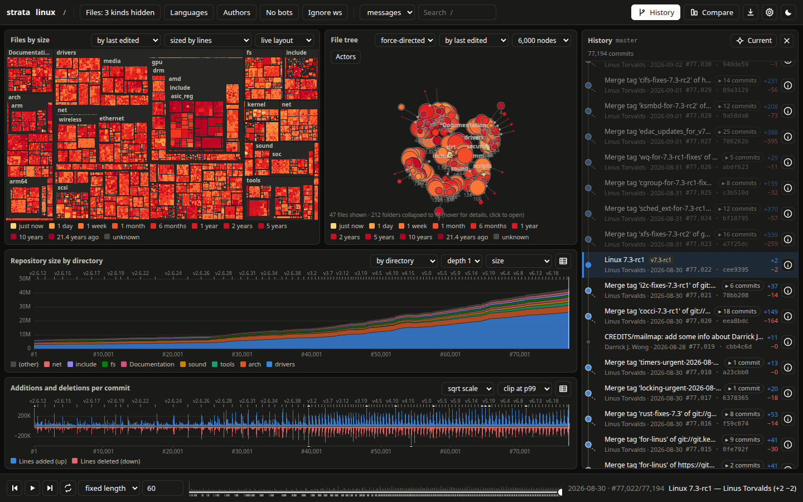

# strata

See how a git repository grew. `strata` reads a repo's history, measures every commit's
additions and deletions, tracks which commit (and author) wrote every surviving line, and plays
the history back in a browser dashboard with four linked views:

- **Evolving treemap**: every file sized by lines, or by lines changed from the start of the
  selected range. It shows what the stacked area shows: directory, language, and author or
  *when written*, as bands inside each file in the area chart's colors. It also shows a
  last-edited heatmap and recent activity. A steady layout keeps every file where it ends up,
  so you can watch it grow or shrink. Wheel or pinch to zoom, drag to pan, click to open a
  folder.
- **File tree**: force-directed (Gource-style, the default), a radial tidy tree, sunburst or
  icicle, all zoomable. Big folders collapse to fit, and author "actors" fly to the files they
  touch.
- **Stacked area**: repository size by directory, language, author (surviving lines) or
  *when lines were written* (survival cohorts), or added/deleted lines per period.
- **Per-commit bars**: additions up, deletions down, with a linear/sqrt/log scale and outlier
  clipping.

One timeline drives all four views. You can play it back (fixed length, commits per second, or
days per second), scrub, brush a range, search, filter by category, language or author, compare
two points (drag their A and B markers along any timeline, or type commit numbers), and export
PNG, SVG, MP4 or GIF.



*The Linux kernel at v7.3-rc1 (77,000 first-parent commits): files colored by how long ago their content
was last edited, yellow for the merge window just closed through deep red for code untouched for years.*

## Quick start

```sh
make                      # builds the web app and target/release/strata
make install              # -> ~/.local/bin/strata (+ libduckdb.so and an app launcher entry)

strata ~/Projects/myrepo                       # extract, serve, open the browser
strata https://github.com/git/git              # clones into the cache first
strata ssh://git@git.example.com/you/project.git
```

Building needs Rust 1.88 or newer, Node.js 22.12 or newer with npm, and `git` on the `PATH`.
The first build downloads a prebuilt `libduckdb`.

Re-running is incremental: only commits since the last run are processed.

Or skip the build: each [release](https://github.com/MrSeal04/strata/releases) ships a
self-contained Linux x86-64 binary with DuckDB compiled in (no `libduckdb.so` needed), and the
same binary as a `.deb`, which also adds strata to the app launcher.

## CLI

| Command | What it does |
|---|---|
| `strata [SOURCE]` | Extract `SOURCE` (path or git URL) if needed, serve, and open the dashboard. Without a source it opens the repo picker. |
| `strata extract SOURCE` | Extract only. `--full` starts over, `--branch B` picks a branch, `--threads N` sets the diff workers, `--merge-attribution blame\|merger` chooses who gets credit for merged lines, `--survival-ws ignore\|strict` sets whitespace handling, `--progress bar\|json\|none` sets the progress format. |
| `strata serve` | Serve every cached repo (`--port`, `--host`, `--no-open`). |
| `strata app` | What the app launcher's **strata** entry runs, in a terminal window: opens the dashboard in the strata server already running, or starts one that runs until you close that window (or press Ctrl-C). `--exit-when-idle` instead stops it 10 minutes after the last dashboard tab closes, for a launcher without a terminal. |
| `strata render REPO -o out.mp4` | Record playback headlessly (Chrome, Chromium or Firefox, plus ffmpeg). Options: `--view`, `--duration`, `--fps`, `--scale`, `--size 1600x900`, `--from/--to`, `--theme`, `--color-by`, `--tree-layout`, `--area-slice`, `--actors`. Writes `.mp4`, `.webm` or `.gif`. |
| `strata list` / `strata gc --older-than 90` | List cached repos, or delete stale ones and their clones. |
| `strata bench SOURCE` | Time the extraction and every query endpoint. Reports peak memory, cache size, and merge-blame work. `--verify N` checks survival attribution against `git blame -w` on N sampled files. |

The cache lives in `~/.cache/strata` (or `$STRATA_HOME`). URL sources are mirrored as bare clones
under `clones/`. A private HTTP(S) repository asks for a login: the dashboard shows a form, and
`strata extract` prompts in the terminal. strata keeps the login in memory until it exits and hands
it to git through a one-off credential helper, so it never reaches the URL, the command line or the
cache. SSH URLs use your keys and ssh-agent as usual. Ctrl-C (or SIGTERM) during an extraction
checkpoints and stops, and the next run continues from there. In the repo picker each cached repo's
card shows its size on disk, with **Update** (fetch and extract the new commits, on the branch it
was extracted from) and **Delete** (its cached data and a URL's clone; a local repository is never
touched).
Other environment knobs: `STRATA_BLAME_JOBS` caps concurrent `git blame` fallbacks (default: half
the CPUs), `STRATA_DUCKDB_MEMORY` caps the server's DuckDB (default 3GB), and `STRATA_LOG=debug`
turns on verbose logs.

## How it works

- **Timeline**: the first-parent chain of the branch. Each merge is one step, so totals never
  double-count. Commits a merge brings in are recorded as its *side commits*, which feed the
  hover cards, search and tag placement.
- **Diffs**: gitoxide tree diffs with rename tracking, and histogram line diffs for every
  changed blob. Each change is counted twice, strict and whitespace-insensitive, so "ignore
  whitespace" is a query-time toggle. Per-step counts match
  `git log --first-parent --numstat --diff-algorithm=histogram` exactly.
- **Survival**: every live file keeps a run-length list recording which commit wrote each line.
  Diffs splice it, so survival is exact at O(changed lines) per step. Lines a merge brings in
  are credited to the side-branch commits that wrote them. strata replays the side branch's
  edits in process, including merges inside it, memoizing line origins per file version. It runs
  `git blame` limited to the side branch only when a version can't be reached. On git/git this
  agrees with `git blame -w HEAD` for 98.5% of lines (90.2% on Linux).
- **Storage**: Parquet parts per repo, plus a resumable checkpoint. The server loads each repo
  into DuckDB and answers binned, filtered queries as Arrow IPC.
- **Web app**: vanilla TypeScript, D3 and Canvas, drawing through a painter interface that also
  emits SVG. Colors follow a colorblind-validated palette. Additions and deletions are blue and
  red by default; classic green/red is available in the settings.

## Per-repo configuration

Put `.strata.toml` in the repo (or `strata.toml` in its cache directory):

```toml
branch = "main"

[identities]
merge = [["jane@old.example", "Jane Doe"]]   # names or emails that are one person
no_merge = ["build@ci.example"]
bots = ["deploy@ci.example"]
humans = ["renovate-human@example.com"]

[classify]                                   # glob -> category
"docs/generated/**" = "generated"
"testdata/**" = "data"
```

Categories are `source`, `docs`, `data`, `notebook`, `lockfile`, `vendored`, `generated`,
`binary` and `submodule`. Lockfiles, vendored, generated and binary files are hidden by default,
and each one is a toggle in the filter row.

## Benchmarks

strata 0.1.4 on a 12-thread desktop, every repository extracted from scratch out of a local mirror
(clone time not included) by `strata bench SOURCE --verify 20`:

| Repo | First-parent commits | Extract | Peak memory (anon) | Cache | Slowest cold query p95 | Agrees with `git blame -w` |
|---|---|---|---|---|---|---|
| strata (this repo) | 58 | 0.07 s | 61 MB (RSS) | <0.1 MB | 11 ms (area by language) | 100% |
| git/git | 24,345 | 21.6 s | 804 MB | 12.8 MB | 52 ms (area by cohort) | 98.5% |
| torvalds/linux | 77,194 | 39 min | 1.8 GB | 226 MB | 250 ms (area by author) | 90.2% |

The last column is the share of surviving lines credited to the same author as
`git blame -w HEAD`, over 20 sampled files. Linux plays back at 35–40 fps in Chrome on a desktop GPU
(treemap by language at step 40,000, about 37k files).

## Development

```sh
make check      # cargo fmt/clippy/test (incl. git oracle tests) + tsc + vitest
make dev        # API on :7420, Vite with hot reload on :5173
make fixtures   # rebuild the deterministic test repos in fixtures/out
node tools/shot.mjs URL out.png [w] [h] [waitMs] [--dark] [--selector CSS] [--eval JS]
```

Dev builds link the prebuilt `libduckdb` (`DUCKDB_DOWNLOAD_LIB=1` in `.cargo/config.toml`).
`make bundled` compiles DuckDB into the binary instead, producing `target/strata-bundled`: one
self-contained 69 MB executable (DuckDB's debug info is stripped; unstripped it is over 1 GB),
with no `libduckdb.so` needed at runtime. It takes about 27 minutes with 3 compile jobs; each
DuckDB compiler process uses 1–1.5 GB, so keep `CARGO_BUILD_JOBS` low on a busy machine.
`make deb` packages it as `target/strata_<version>_amd64.deb` (`tools/make-deb.sh`), with the
library dependencies derived by `dpkg-shlibdeps`.

## License

MIT, see [LICENSE](LICENSE). The language table (`crates/strata-engine/src/langs_table.rs`) is
generated from [github-linguist](https://github.com/github-linguist/linguist) data vendored in
`tools/vendor/`, also MIT ([LICENSE-linguist](tools/vendor/LICENSE-linguist)).
